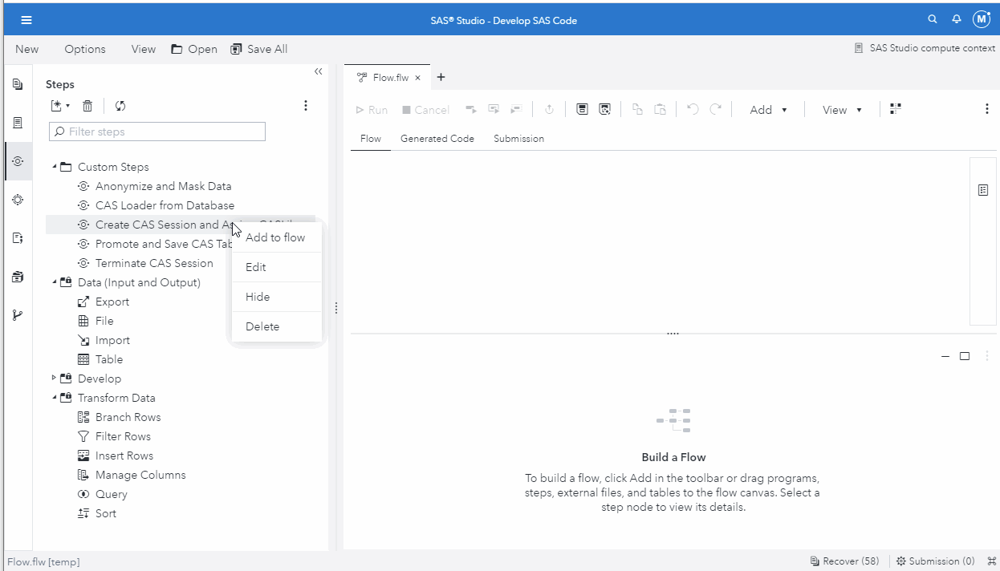

# Create CAS Session and Assign CAS Library

* [Description](#description)
* [SAS Viya Version Support](#sas-viya-version-support)
* [User Interface](#user-interface)
* [Requirements](#requirements)
* [Usage](#usage)
* [Download Step File](#download-step-file)
* [Prompt UI](#prompt-ui)
* [Program](#program)

## Description

The "**Create CAS Session and Assign CAS Library**" Custom Step enables SAS Studio Flow users to create a CAS session with a specified name and creates a SAS libname for the specified CAS library in the SAS Compute session.  If a CAS library is not specified, then the `cas _all_ assign;` code is used.  The default CAS session name is **flow_session**; however, a different name can be specified.

Note:  This code will not assign any CAS libraries longer than 8 characters; however, if a CAS library longer than 8 characters is specified in this Custom Step, then the name will be shortened to 8 characters for the assignment.


## SAS Viya Version Support
2021.1.1 or later

## User Interface


Note:  The input and output ports are optional.  You can add one by right-clicking on the custom step in the SAS Studio Flow and select to "Add input port" or "Add output port" as needed.


## Requirements

* None


## Usage




## Download Step File

[Create CAS Session and Assign CAS Library Custom Step](./Create%20CAS%20Session%20and%20Assign%20CASLibs.step)


## Prompt UI
```json
{
   "syntaxversion": "1.0.0",
   "pages": [
   {
	"id": "CASLibAssign",
	"type": "page",
	"label": "Create CAS Session and Assign CAS Libraries",
	"children": [
		{
			"id": "inTable",
			"type": "inputtable",
			"label": "Select an input table:",
			"required": false
		},	
		{
			"id": "session_text",
			"type": "text",
			"text": "Enter a name for the CAS session to create."
		},
		{
			"id": "cas_session",
			"type": "textfield",
			"label": "CAS session name:",
			"required": true
		},
		{
			"id": "blank_line",
			"type": "text",
			"text": ""
		},
		{
			"id": "caslib_text",
			"type": "text",
			"text": "Enter the name of the CAS library to make available as a SAS libname in the SAS Compute session. If left blank, then all CAS libraries are assigned to the session."
		},
		{
			"id": "caslib_name",
			"type": "textfield",
			"text": "Enter the name of the CAS library to make available as a SAS libname in the SAS Compute session. If left blank, then all CAS libraries are assigned to the session."
		},
		{
			"id": "caslib_name",
			"type": "textfield",
			"label": "CAS library name:",
			"placeholder": "",
			"required": false
		},
		{
			"id": "outTable",
			"type": "outputtable",
			"label": "Specify the output table:",
			"required": false
		}
	]
   }
   ],
	"values": 
		{
			"cas_session":"flow_session"
		}
}
```


## Program
```sas
/* Create CAS Session.  Default session name is "flow_session". */
cas &cas_session;


/* Shorten CASLib Name if Length Greater than 8 */
%macro setCaslibName(caslib_name);
%global shortCaslib_name;

%if %length(&caslib_name) gt 8 %then
   %let shortCaslib_name = %substr(&caslib_name,1,8);
   %else %let shortCaslib_name = &caslib_name;

%mend;
%setCaslibName(&caslib_name);


/* Assign CAS Library to Session */
%if %length(&caslib_name) = 0 %then	%do;
	/* If caslib_name was not specified, then assign all */
	caslib _all_ assign;
	%end;
%else %do;
	/* If caslib_name was specified, then assign specified caslib */
	libname &shortCaslib_name cas caslib="&caslib_name";
	%end;
```
