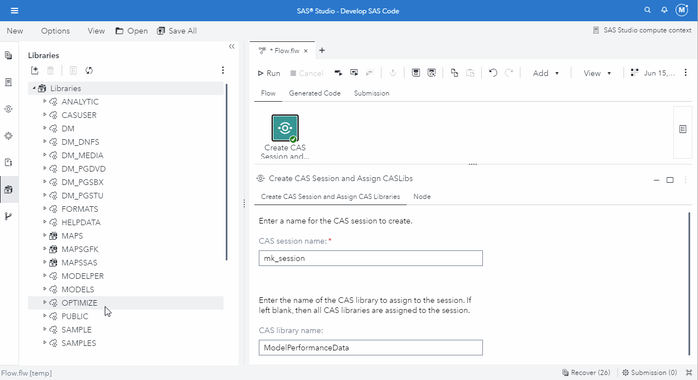

# Terminate CAS Session

* [Description](#description)
* [SAS Viya Version Support](#sas-viya-version-support)
* [User Interface](#user-interface)
* [Requirements](#requirements)
* [Usage](#usage)
* [Download Step File](#download-step-file)
* [Prompt UI](#prompt-ui)
* [Program](#program)
## Description

The "**Terminate CAS Session**" Custom Step enables SAS Studio Flow users to terminate the specified CAS session.  The default CAS session name is **flow_session**; however, a different name can be specified.

## SAS Viya Version Support
2021.1.1 or later
## User Interface


Note:  The input and output ports are optional.  You can add one by right-clicking on the custom step in the SAS Studio Flow and select to "Add input port" or "Add output port" as needed.


## Requirements

* CAS Session has been created


## Usage




## Download Step File

[Terminate CAS Session Custom Step](./Terminate%20CAS%20Session.step)


## Prompt UI
```json
{
   "syntaxversion": "1.0.0",
   "pages": [
   {
	"id": "CASTerminate",
	"type": "page",
	"label": "Terminate CAS Session",
	"children": [
	{
		"id": "inTable",
		"type": "inputtable",
		"label": "Select an input table:",
		"required": false
	},	
	{
		"id": "session_text",
		"type": "text",
		"text": "Enter the name of the CAS session to terminate."
	},
	{
		"id": "cas_session",
		"type": "textfield",
		"label": "CAS session name:",
		"required": true
	},
	{
		"id": "outTable",
		"type": "outputtable",
		"label": "Specify the output table:",
		"required": false
		}
	]
   }
   ],
	"values": 
		{
			"cas_session":"flow_session"
		}
}
```


## Program
```sas
/* Terminate CAS session.  Default session name is "flow_session". */
cas &cas_session terminate;
```
